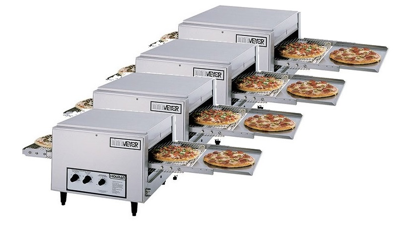

## Dask - Bagging

* Bagging works by taking semi-structured data and preparing that data to be operated on in parallel.
* Bags work on what they have to at any given time, so once a data chunk is processed, it is removed from memory, thus reducing the overall footprint of operations.
* Bagging tends to be less useful than the other methods we will discuss, as unstructured data 

Portions up your semi-structured data so you can...

You can run more data through faster than single threads
 

*in the metaphor, each core is it's own pizza oven

~~~
from dask import bag
bag1 = bag.from_sequence([1, 2, 3, 4, 5, 6, 7, 8, 9, 10], npartitions=2)
bag1.take(3)
~~~
{: .language-python}

`Bag` objects hold the standard functional API found in projects like the Python standard library, `toolz`, or `pyspark`, including `map`, `filter`, `groupby`, etc..

Operations on `Bag` objects create new bags.  Call the `.compute()` method to trigger execution, as we saw for `Delayed` objects.  

~~~
def is_even(n):
    return n % 2 == 0 

small_list = []
for i in range(0,10):
    small_list.append(i)
bag_small = bag.from_sequence(small_list)
~~~
{: .language-python}

~~~
new_list_small = []
for item in small_list:
    if is_even(item):
        new_list_small.append(item**2)
print(new_list_small) 
~~~
{: .language-python}

~~~
filtered_bag_small = bag_small.filter(is_even).map(lambda x: x ** 2)
filtered_bag_small.compute()

filtered_bag_small.visualize()

big_list = []
for i in range(0,10000):
    big_list.append(i)
bag_big = bag.from_sequence(big_list)
~~~
{: .language-python}

~~~
new_list_big = []
for item in big_list:
    if is_even(item):
        new_list_big.append(item**2)
~~~
{: .language-python}

~~~
filtered_bag_big = bag_big.filter(is_even).map(lambda x: x ** 2)
filtered_bag_big.compute()

print("This statement is to stop the Jupyter from dumping the entire output out")
~~~
{: .language-python}

~~~
list_test = []
for item in bag_big:
    if is_even(item):
        delayed(list_test.append(item**2))
        
print(list_test)
~~~
{: .language-python}

Note that when the size of the list increases, bagging becomes a more efficent way of processing data.
