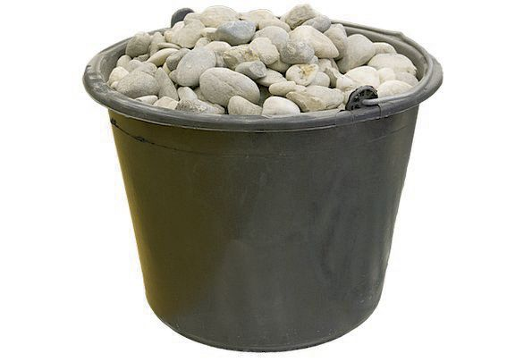

## Dask - Arrays

* Dask arrays are a multidimensional, structured data format that are useful for manipulating large amounts of numerical data. 
* Dask arrays can be thought of as distributed Numpy arrays and can be manipulated in parallel.
* Much of the syntax for Dask arrays is lifted directly from numpy.
* Dask arrays are useful for pre-processing larger than memory datasets, and can also be used to feed some machine learning algorithms, just like numpy.

~~~
from dask import array as da
new_dask_array = da.from_array(array_square)

dask_square = da.square(new_dask_array)
~~~
{: .language-python}

~~~
dask_square.compute()

dask_square.visualize()
~~~
{: .language-python}

~~~
np.square(array_square)
dask_square.compute()

#import a small dataset from SKLearn for later
from sklearn import datasets
iris_data = datasets.load_iris()
iris_attributes = iris_data.data
iris_classes = iris_data.target

iris_attributes_dask = da.from_array(iris_attributes)

mean = da.mean(iris_attributes_dask)
da.mean(iris_attributes_dask).compute()
mean.visualize()

da.mean(iris_attributes_dask).visualize()
~~~
{: .language-python}

~~~
print(np.mean(iris_attributes))
print(da.mean(iris_attributes_dask).compute())

x = da.random.random((10000, 10000), chunks=(1000, 1000))
z = da.mean(x).compute()
~~~
{: .language-python}

~~~
x.compute()
~~~
{: .language-python}

~~~
z.compute()
z.visualize()

You can also force DASK arrays to hold the data in memory as well, using the persist comman

x_persist = x.persist()
z_persist = da.mean(x_persist)
~~~
{: .language-python}

~~~
z_persist.compute()
~~~
{: .language-python}

## Dask - Arrays: Limitations

* Not all of numpy is included in dask, specifically sorting, listing, and some smaller functions
* Dask tends to be slightly slower than loading the entire dataset into memory

## Dask arrays allows you to move mountians

## A bucket of rocks at a time

