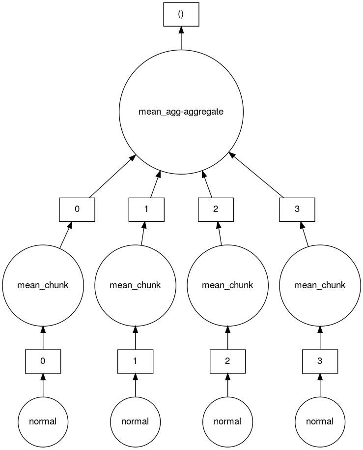

In the previous episode we used NumPy to speed up the computation of the mean of a large number of random numbers getting a speed up of something like 46 times. However this computation is still only done in serial, although much faster than using standard Python.

Let say we wanted to do some computation, we will stick with the mean for now, over a really large number of numbers. Lets take our script from the previous episode `numpy-mean.py` and adjust it a little do even more numbers. Lets also add the creation of these random numbers to our timing. Why we are adding that to our timing will become apparent shortly.

~~~
$ cp numpy-mean.py numpy-mean-lg.py
$ nano numpy-mean-lg.py
~~~
{: .language-bash}

~~~
...
def main():

  #about 6G of random numbers (dim x 8 bytes/number)
  dim=50000000*16

  start=time.time()
  randomArray=np.random.normal(0.0,0.1,size=dim)
  mean=randomArray.mean()
  computeTime=elapsed(start)
...
~~~
{: .language-python}
[numpy-mean-lg.py](https://raw.githubusercontent.com/acenet-arc/ACENET_Summer_School_Dask/gh-pages/code/numpy-mean-lg.py)

Because we are working with so many numbers we now need some more significant memory so our `srun` command will have to request that.
~~~
$ srun --mem=6G python numpy-mean-lg.py
~~~
{: .language-bash}
~~~
mean is 5.662568700976701e-06

==================================
compute time: 28.99828577041626s
==================================

----------------------------------------
wall clock time:29.021820068359375s
----------------------------------------
~~~
{: .output}

Wouldn't it be nice if we could create and process these arrays in parallel. It turns out Dask has [Arrays](https://docs.dask.org/en/stable/array.html#) which work very similarly to NumPy but in parallel and optionally in a distributed way. Lets try out using Dask arrays on the above example.

~~~
$ cp numpy-mean-lg.py array-mean.py
$ nano array-mean.py
~~~
{: .language-bash}

~~~
import time
import dask.array as da
...
def main():

  #about 6G of random numbers
  dim=50000000*16
  numChunks=4

  randomArray=da.random.normal(0.0,0.1,size=dim,chunks=(int(dim/numChunks)))
  meanDelayed=randomArray.mean()
  meanDelayed.visualize()

  start=time.time()
  mean=meanDelayed.compute()
  computeTime=elapsed(start)

...
~~~
{: .language-python}
[array-mean.py](https://raw.githubusercontent.com/acenet-arc/ACENET_Summer_School_Dask/gh-pages/code/array-mean.py)

Above we have replace `import numpy as np` with `import dask.array as da` and replaced `np` with `da`. The `da.random.normal()` call is nearly identical to the `np.random.normal()` call except that there is the additional parameter `chunks=(<size-of-chunk>)`. Here we are calculating the size of the chunk based on the overall dimension of the array and how many chunks we want to create.

We have also added `meanDelayed.visualize()` to let us take a look at the task graph to see what Dask is doing.

Finally called the `compute()` function on the `meanDelayed` object to compute the final mean. This computation step both creates the array we are computing on using the same normal distribution and also computes the mean all with the `compute()` call. This is why we switched to timing both of these steps above so that we can more directly compare with the timings when using Daks array. 

Now lets run it and see how we did.
~~~
$ srun --mem=7G --cpus-per-task=4 python array-mean.py&
~~~
{: .language-bash}
~~~
mean is -3.506459933572822e-06

==================================
compute time: 7.353188514709473s
==================================

----------------------------------------
wall clock time:7.639941930770874s
----------------------------------------
~~~
{: .output}

We can take a look at the task graph that Dask created to create and calculate the mean of this 4 chunk array.
~~~
$ feh mydask.png
~~~
{: .language-python}

Here you can see that there are 4 tasks which create 4 array chunks from the `normal` distribution. These chunks are then input to the `mean` function which calculates the mean on each chunk. Finally a `mean` function which aggregates all the means of the chunks together is called to produce the final result.

TODO:
* do exercise for distributed array-mean
* talk about memory usage a bit to help explain why doing this in a distributed way can be nice.
<!--
As these NumPy arrays get big it gets harder and harder to fit them into memory. Wouldn't it be nice to be able to split up these arrays and work on them in parallel. 

Might be a nice way to visualize what is going on without doing something too complex to really be able to visualize.
~~~
size=4
chunkFrac=0.5
x=dask.array.random.random((size,size),chunks=(int(size*chunkFrac),int(size*chunkFrac))
x.sum().visualize()
~~~
{: .python}

might be good to compare with just using numpy directly

#### NumPy version
~~~
import numpy as np
x=np.random.normal(10,0.1,size=(20000,20000))#400 million numbers, each 64 bits, total about 3.2GB
y=x.mean(axis=0)[::100]
~~~
{: .python}
needs GB of memory, and takes more than 10 seconds
#### Dask array vesrion
~~~
import numpy as np
import dask.array as da

x=da.random.nomral(10,0.1,size(20000,20000),chunks(1000,1000))# 400 million element array each 64 bits, cut into 1000x1000 sized chunks, 8MB/chunk, 20x20 chunks, can perform NumPy-style operations
y=x.mean(axis=0)[::100]
y.compute()
~~~
{: .python}
needs MB of memory and less time to execute

[Dask Array Docs][https://docs.dask.org/en/latest/array.html]
 - lists NumPy operations available
[best practices for Dask array](https://docs.dask.org/en/latest/array-best-practices.html)

-------------
* [Data Frames best practices](https://docs.dask.org/en/latest/dataframe-best-practices.html)
* [Delayed best practices](https://docs.dask.org/en/latest/delayed-best-practices.html)
* [General best practices](https://docs.dask.org/en/latest/best-practices.html)
* [Dask examples](https://examples.dask.org)

-->

