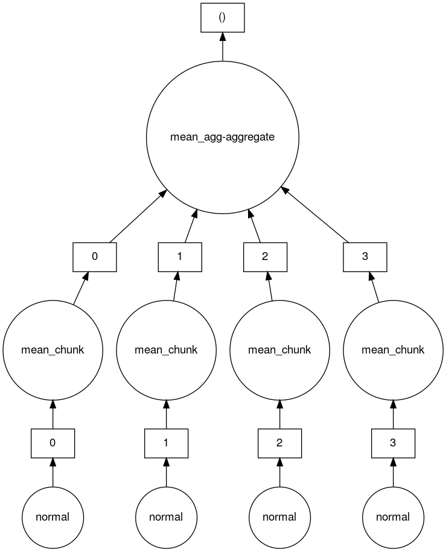

In the previous episode we used NumPy to speed up the computation of the mean of a large number of random numbers getting a speed up of something like 46 times. However this computation is still only done in serial, although much faster than using standard Python.

Let say we wanted to do some computation, we will stick with the mean for now, over a really large number of numbers. Lets take our script from the previous episode `numpy-mean.py` and adjust it a little do even more numbers. Lets also add the creation of these random numbers to our timing. Why we are adding that to our timing will become apparent shortly.

~~~
$ cp numpy-mean.py numpy-mean-lg.py
$ nano numpy-mean-lg.py
~~~
{: .language-bash}

~~~
...
def main():

  #about 6G of random numbers (dim x 8 bytes/number)
  dim=50000000*16

  start=time.time()
  randomArray=np.random.normal(0.0,0.1,size=dim)
  mean=randomArray.mean()
  computeTime=elapsed(start)
...
~~~
{: .language-python}
[numpy-mean-lg.py](https://raw.githubusercontent.com/acenet-arc/ACENET_Summer_School_Dask/gh-pages/code/numpy-mean-lg.py)

Because we are working with so many numbers we now need some more significant memory so our `srun` command will have to request that.
~~~
$ srun --mem=6G python numpy-mean-lg.py
~~~
{: .language-bash}
~~~
mean is 5.662568700976701e-06

==================================
compute time: 28.99828577041626s
==================================

----------------------------------------
wall clock time:29.021820068359375s
----------------------------------------
~~~
{: .output}

Wouldn't it be nice if we could create and process these arrays in parallel. It turns out Dask has [Arrays](https://docs.dask.org/en/stable/array.html#) which work very similarly to NumPy but in parallel and optionally in a distributed way. Lets try out using Dask arrays on the above example.

~~~
$ cp numpy-mean-lg.py array-mean.py
$ nano array-mean.py
~~~
{: .language-bash}

~~~
import time
import dask.array as da
...
def main():

  #about 6G of random numbers
  dim=50000000*16
  numChunks=4

  randomArray=da.random.normal(0.0,0.1,size=dim,chunks=(int(dim/numChunks)))
  meanDelayed=randomArray.mean()
  meanDelayed.visualize()

  start=time.time()
  mean=meanDelayed.compute()
  computeTime=elapsed(start)

...
~~~
{: .language-python}
[array-mean.py](https://raw.githubusercontent.com/acenet-arc/ACENET_Summer_School_Dask/gh-pages/code/array-mean.py)

Above we have replace `import numpy as np` with `import dask.array as da` and replaced `np` with `da`. The `da.random.normal()` call is nearly identical to the `np.random.normal()` call except that there is the additional parameter `chunks=(<size-of-chunk>)`. Here we are calculating the size of the chunk based on the overall dimension of the array and how many chunks we want to create.

We have also added `meanDelayed.visualize()` to let us take a look at the task graph to see what Dask is doing.

Finally called the `compute()` function on the `meanDelayed` object to compute the final mean. This computation step both creates the array we are computing on using the same normal distribution and also computes the mean all with the `compute()` call. This is why we switched to timing both of these steps above so that we can more directly compare with the timings when using Daks array. 

Now lets run it and see how we did.
~~~
$ srun --mem=7G --cpus-per-task=4 python array-mean.py&
~~~
{: .language-bash}
~~~
mean is -3.506459933572822e-06

==================================
compute time: 7.353188514709473s
==================================

----------------------------------------
wall clock time:7.639941930770874s
----------------------------------------
~~~
{: .output}

We can take a look at the task graph that Dask created to create and calculate the mean of this 4 chunk array.
~~~
$ feh mydask.png
~~~
{: .language-python}

Here you can see that there are 4 tasks which create 4 array chunks from the `normal` distribution. These chunks are then input to the `mean` function which calculates the mean on each chunk. Finally a `mean` function which aggregates all the means of the chunks together is called to produce the final result.

> ## Array distributed
> These arrays are getting kind of big and processing them either in parallel or in serial on a single compute node restricts us to nodes that have more than about 7G of memory. Now on real clusters 7G of memory isn't too bad but if arrays get bigger this could easily start to restrict how many of the nodes on the clusters you can run your jobs on to only the fewer more expensive large memory nodes. However, Dask is already processing our arrays in separate chunks on the same node couldn't we distributed it across multiple nodes and reduce our memory requirement for an individual node?
> 
> If we wanted to be able to run computations of large arrays with less memory per compute node could we distributed these computations across multiple nodes? Yes we can using the distributed computing method we saw earlier.  
>
> **Hint:** When submitting distributed jobs (using an MPI environment) we need to use `--ntasks=N` to get `N` distributed CPUs. With 4 chunks we would want 4 workers, so `--ntasks=6`. Similarly when requesting memory, we have to request it per CPU with `--mem-pre-cpu=2G`.
> 
> > ## Solution
> > Start with the `array-mean.py` script we just created and add to it the 
> > distributed Dask cluster creation code.
> > ~~~
> > $ cp array-mean.py array-distributed-mean.py
> > $ nano array-distributed-mean.py
> > ~~~
> > {: .language-bash}
> >
> > 

> > ~~~
> > import time
> > import dask.array as da
> > import dask_mpi as dm
> > import dask.distributed as dd
> > ...
> > def main():
> >   dm.initialize()
> >   client=dd.Client()
> >   
> >   #about 6G of random numbers
> >   dim=50000000*16
> >   numChunks=4
> > ...
> > ~~~
> > {: .language-python}
> > [array-distributed-mean.py](https://raw.githubusercontent.com/acenet-arc/ACENET_Summer_School_Dask/gh-pages/code/array-distributed-mean.py)
> > 

> > 
> > ~~~
> > $ srun --ntasks=6 --mem-per-cpu=2G python array-distributed-mean.py
> > ~~~
> > {: .language-bash}
> > ~~~
> > ...
> > 2024-06-06 13:50:28,534 - distributed.core - INFO - Starting established connection to tcp://192.168.239.99:39087
> > mean is 1.2003325729765707e-06
> > 
> > ==================================
> > compute time: 5.8905346393585205s
> > ==================================
> > 
> > ----------------------------------------
> > wall clock time:7.741526126861572s
> > ----------------------------------------
> > 
> > 2024-06-06 13:50:34,571 - distributed.scheduler - INFO - Receive client connection: Client-bf5e693a-240b-11ef-a3fc-fa163efada25
> > ...
> > ~~~
> > {: .output}
> > Each of our tasks is only using 2G of memory and these tasks could be on the same node, or spread across different nodes. While overall we are using 2Gx6=12G of memory.
> > 
> {: .solution}
{: .challenge}

> ## Bigger distributed arrays
> Lets try an even bigger array. Lets multiply our existing dim by `16` so that we have `dim=50000000*16*16` and lets do the same with our `numChunks` so that we have `numChunks=4*16`. With this configuration we will have 6Gx16=96G of numbers and 4x16=64 chunks. Then run with `--ntasks=66` and the same amount of memory per CPU, `--mem-per-cpu=2G`. In total we are asking for 2Gx66=132G, more than we need, but this is OK since anything less than about 4G per CPU is less than the smallest RAM/CPU ratio on all nodes on Alliance clusters.
> > 
> > ## Solution
> > ~~~
> > $ nano array-distributed-mean.py
> > ~~~
> > {: .language-bash}
> >
> > ~~~
> > import time
> > import dask.array as da
> > import dask_mpi as dm
> > import dask.distributed as dd
> > ...
> > def main():
> >   dm.initialize()
> >   client=dd.Client()
> >   
> >   #about 6G of random numbers
> >   dim=50000000*16*16
> >   numChunks=4*16
> > ...
> > ~~~
> > {: .language-python}
> > 
> > ~~~
> > $ srun --ntasks=66 --mem-per-cpu=2G python array-distributed-mean.py
> > ~~~
> > {: .language-bash}
> > ~~~
> > ...
> > 2024-06-06 14:01:12,390 - distributed.core - INFO - Starting established connection to tcp://192.168.239.99:36127
> > mean is 3.018765902042423e-07
> > 
> > =================================
> > compute time: 12.445163011550903s
> > =================================
> > 
> > ---------------------------
> > wall clock time:21.902076482772827s
> > ---------------------------
> > 
> > 2024-06-06 14:01:26,254 - distributed.scheduler - INFO - Receive client connection: Client-43cd0503-240d-11ef-a46b-fa163efada25
> > ...
> > ~~~
> > {: .output}
> {: .solution}
{: .challenge}

