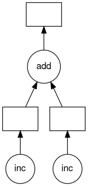

## Server Setup

We will be using a bit of software called noVNC to have an interactive desktop environment (using the Linux MATE desktop) where we can write and run python and dask scripts. One downside of this however, is the clip board does not work between your computer and the desktop or in other words you **can not copy and paste** between your laptop and the remote desktop.

To login go to [jupyter.pcs.ace-net.training](jupyter.pcs.ace-net.training) in your web browser and use the same username/password provided for our virtual training cluster. Don't worry about the one-time-password (OTP) and click *Sign In*.

This provides a Jupyter Hub interface which allows running interactive desktop and notebook sessions. For the next two sessions we will be using the ***Desktop*** *User interface*. Select that from the drop down box; **Do Not Start yet!**

Also set **Number of cores** to **2** and **Time** to **3**. This is important because if you don't change these settings your session will stop after 1 hour and only have one core, which makes it hard to see any parallelism.

Finally at the bottom and click the orange *Start* button. It will take a minute or two for your desktop session to start.

> ## Stopping the server
> If you need to stop your server for some reason you can go to
> [jupyter.pcs.ace-net.training/hub/home](https://jupyter.pcs.ace-net.training/hub/home)
> and click *Stop My Server*.
{: .callout}

## Running a Python script

Next get a terminal up by right clicking on the empty desktop and choosing ***Open in Terminal***.

To start the text editor we will write our python programs in type the following into the terminal.

~~~
$ pluma hello.py&
~~~
{: bash}

This starts the text editor *pluma* in the background (because of the use of the `&`) editing a new file `hello.py` in the background.

> ## Font size
> Font size of the terminal or the editor can be changed by pressing `ctrl`+`+` (note you need to hold down the shift key to get `+` instead of `=`. To decrease the font size you can press `ctrl`+`-`.
{: .callout}

Lets create our first python script in this new environment just to check that we have everything working. In the editor add the following code.

~~~
def main():
  print("hello world")

if __name__=="__main__":
  main()
~~~
{: .python}

The save the newly created file by going to the menu ***file*** -> ***save***, or pressing the `ctrl`+`s` key combination on your keyboard.

Next switch back to the terminal window and load the default python module.

~~~
$ module load python
~~~
{: .bash}

There is a version of python already available on the login node, but for consistency between clusters it is better to use the python version available through module system. We can then 
run the script to see if everything is working.

~~~
$ python ./hello.py
~~~
{: .bash}
~~~
hello world
~~~
{: .output}

Now lets add a bit more interesting code that will allow us to start exploring how to use Dask. Lets save our current script as a new file by going ***file*** -> ***save as*** and change the file name to ``no-dask.py`` which will contain our new script before we add in any Dask.

~~~
from time import sleep

def inc(x):
  sleep(1)
  return x+1
def add(x,y):
  sleep(1)
  return x+y

def main():
  x=inc(1)
  y=inc(2)
  z=add(x,y)
  print("z is "+str(z))

if __name__=="__main__":
  main()
~~~
{: .python}

Then run our new script and time it with the `time` command.
~~~
$ time python ./no-dask.py
~~~
{: .bash}
~~~
z is 5

real    0m3.077s
user    0m0.017s
sys     0m0.014s
~~~
{: .output}
It takes about 3s which isn't too surprising since we have three function calls all with a 1s `sleep` in them. Clearly this sleep is dominating the run time. This is obviously artifical but will allows us to have a well understood compute requirements while we are exploring Dask.

## Dask Delayed

Before we can use dask we must install it with the following command on the terminal.
~~~
$ pip install pandas numpy dask distributed graphviz bokeh dask_jobqueue mimesis requests matplotlib
~~~
{: .bash}

This actually installs lots of stuff, not just dask, but should take around 2 minutes or a bit less.

<!--
While those install lets continue pretending that we have everything installed already.
> ## Virtual environments
> It is often good practice to create **virtual environments** when working in Python. These environments let you install python modules in an independent environment so that when working with a particular set of modules for a particular task they are all contained. If you need to work on a different task with different module requirements you can create a different virtual environment. If you need to reset or recreate a virtual environment you can easily delete the folder they have been created in.
> 
> To create a virutal environment use the follow command.
> ~~~
> $ virtualenv --no-download <env-name>
> ~~~
> {: .bash}
> To start working in the new environment (also called activating the environment) use the following command.
> ~~~
> $ source <env-name>/bin/activate
> ~~~
> {: .bash}
> You can then install modules using the `pip` command as usual.
>
> To deactivate a virtual environment type the following command.
> ~~~
> (<env-name>)$ deactivate
> ~~~
> {: .bash}
> For more details see [Creating and using virtual environments on Alliance clusters](https://docs.alliancecan.ca/wiki/Python#Creating_and_using_a_virtual_environment).
{: .callout}-->

Looking back at the Python code we have, the two increment calls *could* be called in parallel, because they are totally independent of one-another. We can call `dask.delayed` on our functions to make them **lazy**. When we say **lazy** it means that those functions won't be called immediately. What happens instead is that it records what we want to compute as a task into a graph that we will run later using the `compute` member function on the object returned by the `dask.delayed` function. However, to illustrate that nothing happens until `z.compute()` is called lets comment out that line and run it.

~~~
from time import sleep
from dask import delayed

def inc(x):
  sleep(1)
  return x+1
def add(x,y):
  sleep(1)
  return x+y

def main():
  x=delayed(inc)(1)
  y=delayed(inc)(2)
  z=delayed(add)(x,y)

  #z.compute()

if __name__=="__main__":
  main()
~~~
{: .python}

~~~
$ time python ./dask-delay.py
~~~
{: .bash}
~~~

real  0m0.418s
user  0m0.236s
sys   0m0.054s
~~~
{: .output}

It clearly didn't call our `inc` or `add` functions as any one of those calls should take at least 1 s and the total time is well below 1s. Now lets uncomment the `z.compute()` line and rerun and time.

~~~
$ time python ./dask-delay.py
~~~
{: .bash}
~~~

real  0m2.366s
user  0m0.236s
sys   0m0.054s
~~~
{: .output}

So it is clearly improving our runtime. To help us understand what Dask is doing we can use the `visualize` `delayed` object member function which creates a visualization of the graph Dask uses for our tasks.

~~~
...
def main():
  ...
  #z.compute()
  z.visualize()
...
~~~
{: .python}

~~~
$ python ./dask-delay.py
~~~
{: .bash}

Which returns almost immediately, but it has created a `mydask.png` file. Lets have a look at it.

~~~
$ feh mydask.png
~~~
{: .bash}

Notice that this includes the names of the functions from our script and the logical flow of the outputs from the `inc` function to the inputs of the `add` function.

Here you can see that the two `inc` functions can be run in parallel provided we have hardware capable of running them at the same time and afterwards the `add` function will be run in serial.

> ## Challenge
> Apply what you have learned to parallelize the below loop with `dask.delayed`
> ~~~
> 
> ~~~
> {: .python}
> you can download with 
> ~~~
> $ wget 
> ~~~
> > ## Solution
> > Solution text
> {: .solution}
{: .challenge}