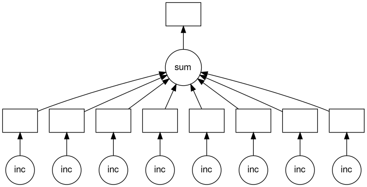
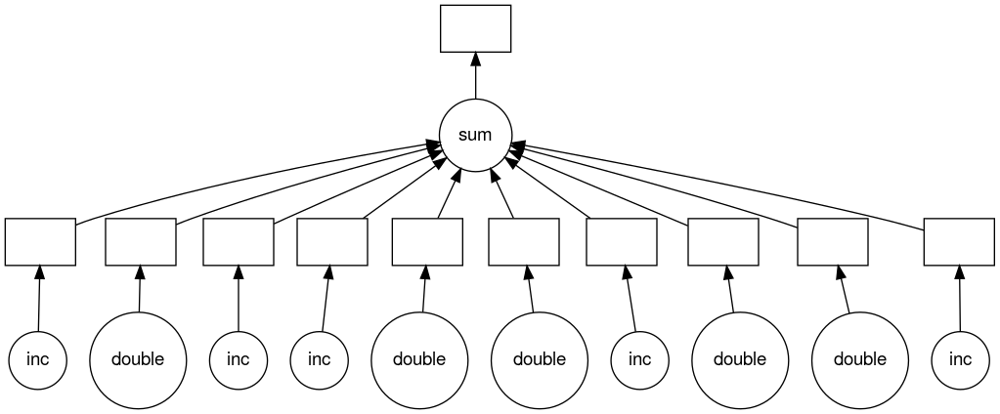

## Dask Delayed

Before we can use dask we must install it with the following command on the terminal.
~~~
$ pip install pandas numpy dask distributed graphviz bokeh dask_jobqueue mimesis requests matplotlib
~~~
{: .bash}

This actually installs lots of stuff, not just Dask, but should take around 2 minutes or a bit less. This will install these modules into the virtual environment we setup and are currently working in.

Looking back at the Python code we have, the two calls to the `inc` functions *could* be called in parallel, because they are totally independent of one-another.

We can use `dask.delayed` on our functions to make them **lazy**. When we say **lazy** it means that those functions won't be called immediately. What happens instead is that it records what we want to compute as a task into a graph that we will run later using the `compute` member function on the object returned by the `dask.delayed` function. 

Lets add the new Dask code now.

~~~
import time
import dask

def inc(x):
  time.sleep(1)
  return x+1
def add(x,y):
  time.sleep(1)
  return x+y

def main():
  x=dask.delayed(inc)(1)
  y=dask.delayed(inc)(2)
  z=dask.delayed(add)(x,y)
  #result=z.compute()
  #print("result="+str(result))
if __name__=="__main__":
  start=time.time()
  main()
  end=time.time()
  print("wall clock time:"+str(end-start)+"s")
~~~
{: .python}

However, to illustrate that nothing happens until `z.compute()` is called lets comment it and the following print line out and run it.

~~~
$ srun python ./dask-delay.py
~~~
{: .bash}
~~~
wall clock time:0.00028586387634277344s
~~~
{: .output}

It clearly didn't call our `inc` or `add` functions as any one of those calls should take at least 1 s and the total time is well below 1s. Now lets uncomment the code and rerun it.

~~~
...

def main():
  ...
  z=dask.delayed(add)(x,y)
  result=z.compute()
  print("result="+str(result))
...
~~~
{: .python}
[dask-delay.py](https://raw.githubusercontent.com/acenet-arc/ACENET_Summer_School_Dask/gh-pages/code/dask-delay.py)

~~~
$ srun python ./dask-delay.py
~~~
{: .bash}
~~~
result=5
wall clock time:3.0056424140930176s
~~~
{: .output}

Hey, that's no faster than the non-dask version. In fact it is a very tiny bit slower. What gives? Well, we only ran it on one core. Lets try on two cores and see what hapens.

~~~
$ srun --cpus-per-task=2 python ./dask-delay.py
~~~
{: .bash}
~~~
result=5
wall clock time:2.004542350769043s
~~~
{: .output}

Ah that's better it is now down to 2s from our original 3s. To help us understand what Dask is doing we can use the `visualize` `delayed` object member function which creates a visualization of the graph Dask uses for our tasks.

~~~
...
def main():
  ...
  z=dask.delayed(add)(x,y)
  z.visualize()
  result=z.compute()
  print("result="+str(result))
...
~~~
{: .python}

~~~
$ srun python ./dask-delay.py
~~~
{: .bash}

Which returns fairly quickly because we aren't actually doing any work. However it has created a `mydask.png` file which lets us visualize what Dask will do. Lets have a look at it (this requires the -X option to work and a x11 server running).

~~~
$ feh mydask.png
~~~
{: .bash}

Notice that this includes the names of the functions from our script and the logical flow of the outputs from the `inc` function to the inputs of the `add` function.

Here you can see that the two `inc` functions can be run in parallel provided we have hardware capable of running them at the same time and afterwards the `add` function will be run in serial.

> ## Parallelize a loop
> Download the below script with the below `wget` command.
> ~~~
> $ wget https://raw.githubusercontent.com/acenet-arc/ACENET_Summer_School_Dask/gh-pages/code/dask-loop-template.py
> ~~~
> {: .bash}
> 

> ~~~
> import time
> 
> def inc(x):
>   time.sleep(1)
>   return x+1
> def main():
>   data=[1,2,3,4,5,6,7,8]
>   dataInc=[]
>   for x in data:
>     y=inc(x)
>     dataInc.append(y)
>   total=sum(dataInc)
>   print("total="+str(total))
> if __name__=="__main__":
>   start=time.time()
>   main()
>   end=time.time()
>   print("wall clock time:"+str(end-start)+"s")
> ~~~
> {: .python}
> [dask-loop-template.py](https://raw.githubusercontent.com/acenet-arc/ACENET_Summer_School_Dask/gh-pages/code/dask-loop-template.py)
> 

> Run this script to with `--cpus-per-task=1` and note the run time.
> 
> Then apply what you have learned to parallelize this script. Then run with `--cpus-per-task=1`,`2`, and `4` and note the times.
> > ## Solution
> > 

> > ~~~
> > import time
> > import dask
> > ...
> > def main():
> >   ...
> >   for x in data:
> >     y=dask.delayed(inc)(x)
> >     dataInc.append(y)
> >   total=dask.delayed(sum)(dataInc)
> >   result=total.compute()
> >   print("total="+str(result))
> > ...
> > ~~~
> > {: .python}
> > [dask-loop-solution.py](https://raw.githubusercontent.com/acenet-arc/ACENET_Summer_School_Dask/gh-pages/code/dask-loop-template.py)
> > 

> > #### Serial
> > ~~~
> > srun --cpus-per-task=1 python dask-loop-template.py
> > ~~~
> > {: .bash}
> > ~~~
> > total=44
> > wall clock time:8.008957147598267s
> > ~~~
> > {: .output}
> > #### Delayed Serial
> > ~~~
> > srun --cpus-per-task=1 python dask-loop-solution.py
> > ~~~
> > {: .bash}
> > ~~~
> > total=44
> > wall clock time:8.009050607681274s
> > ~~~
> > {: .output}
> > #### Delayed 2 CPUs
> > ~~~
> > srun --cpus-per-task=2 python dask-loop-solution.py
> > ~~~
> > {: .bash}
> > ~~~
> > total=44
> > wall clock time:4.008902311325073s
> > ~~~
> > {: .output}
> > #### Delayed 4 CPUs
> > ~~~
> > srun --cpus-per-task=4 python dask-loop-solution.py
> > ~~~
> > {: .bash}
> > ~~~
> > total=44
> > wall clock time:2.005645990371704s
> > ~~~
> > {: .output}
> {: .solution}
{: .challenge}

> ## Visualize loop parallelization
> Use the solution to the previous challenge, shown below, to visualize how the loop is being parallelized by Dask.
> 

> ~~~
> import time
> import dask
> 
> def inc(x):
>   time.sleep(1)
>   return x+1
> def main():
>   data=[1,2,3,4,5,6,7,8]
>   dataInc=[]
>   for x in data:
>     y=dask.delayed(inc)(x)
>     dataInc.append(y)
>   total=dask.delayed(sum)(dataInc)
>   result=total.compute()
>   print("total="+str(result))
> if __name__=="__main__":
>   start=time.time()
>   main()
>   end=time.time()
>   print("wall clock time:"+str(end-start)+"s")
> ~~~
> {: .python}
> [dask-loop-solution.py](https://raw.githubusercontent.com/acenet-arc/ACENET_Summer_School_Dask/gh-pages/code/dask-loop-template.py)
> 

> > ## Solution
> > ~~~
> > ...
> > def main():
> >   ...
> >   total=dask.delayed(sum)(dataInc)
> >   total.visualize()
> >   result=total.compute()
> >   ...
> > ~~~
> > {: .python}
> > ~~~
> > $ srun --cpus-per-task=4 python dask-loop-solution.py
> > $ feh mydask.png
> > ~~~
> > {: .bash}
> > 
> > {: .output}
> {: .solution}
{: .challenge}

> ## Parallelize loop with flow control
> Download the below script with the below `wget` command.
> ~~~
> $ wget https://raw.githubusercontent.com/acenet-arc/ACENET_Summer_School_Dask/gh-pages/code/dask-loop-flow-template.py
> ~~~
> {: .bash}
> 

> ~~~
> import time
> 
> def inc(x):
>   time.sleep(1)
>   return x+1
> def double(x):
>   time.sleep(1)
>   return 2*x
> def isEven(x):
>   return not x % 2
> def main():
>   data=[1,2,3,4,5,6,7,8,9,10]
>   dataProc=[]
>   for x in data:
>     if isEven(x):
>       y=double(x)
>     else:
>       y=inc(x)
>     dataProc.append(y)
> 
>   total=sum(dataProc)
>   print("total="+str(total))
> if __name__=="__main__":
>   start=time.time()
>   main()
>   end=time.time()
>   print("wall clock time:"+str(end-start)+"s")
> ~~~
> {: .python}
> [dask-loop-flow-template.py](https://raw.githubusercontent.com/acenet-arc/ACENET_Summer_School_Dask/gh-pages/code/dask-loop-flow-template.py)
> 

> Then parallelize with `dask.delayed`, `compute`, and visualize the task graph.
> > ## Solution
> > 

> > ~~~
> > import time
> > import dask
> > ...
> > def main():
> >   ...
> >   for x in data:
> >     if isEven(x):
> >       y=dask.delayed(double)(x)
> >     else:
> >       y=dask.delayed(inc)(x)
> >     dataProc.append(y)
> > 
> >   total=dask.delayed(sum)(dataProc)
> >   total.visualize()
> >   result=total.compute()
> >   ...
> > ~~~
> > {: .python}
> > [dask-loop-flow-solution.py](https://raw.githubusercontent.com/acenet-arc/ACENET_Summer_School_Dask/gh-pages/code/dask-loop-flow-solution.py)
> > 

> > 
> {: .solution}
{: .challenge}