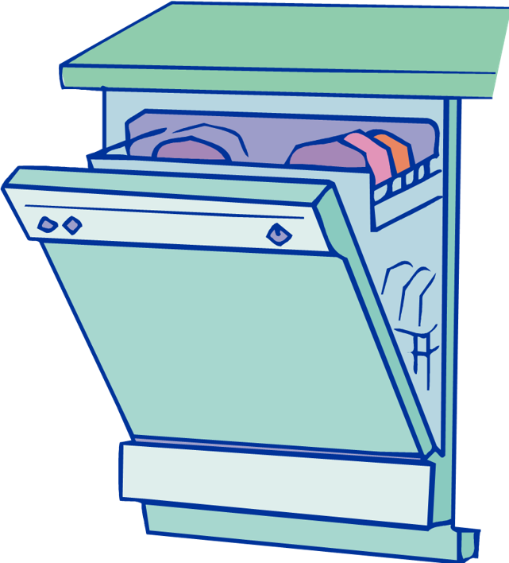

# Global Interpreter Lock
Parallel programming with Python has a complicated history because of a design decision, the Global Interpreter Lock, which limits python to a single thread most of the time. Global interperter lock is a complicated subject that I'm not prepared to digress into. If you really want to know about the GIL, https://realpython.com/python-gil/ , https://en.wikipedia.org/wiki/Global_interpreter_lock

Dask is a way to work in parallel with python and circumvent the Global Interperater Lock.

## DASK - General

Dask is a lazy framework that automates parallel operations. Lazy, meaning that it doesn’t operate until it is told to.

Dask is conceptually similar to a dishwasher\*, where it will wait idle until it’s told to do everything all at once**.

*Using Dask does not guarantee your code will be clean.

**Not everything actually done all at once, Dask does several things at once.

## An artist's rendition of DASK before running based on my description

## Dask - Distributed

Dask can operate as it’s own task manager in one of three ways:
1. Threaded – Using small, independent chunks of code running in the same instance of a computer program. Best for operations on numerical data that doesn’t keep a Global Interpreter Lock* (e.g. Numpy, Pandas, Scikit-Learn).
2. Processes – Sends data to separate instances of a program to be processed.  Generally works best when there are several instances of a program running at simultaneously that hold the Global Interpreter Lock*.
3. Single-Threaded – Does one chunk of code at a time, with no parallel capacity. Primarily for Debugging.

Parallel programming with Python has a complicated history because of a design decision, the Global Interpreter Lock, which limits python to a single thread most of the time. Global interperter lock is a complicated subject that I'm not prepared to digress into. If you really want to know about the GIL, [https://realpython.com/python-gil/](https://realpython.com/python-gil/), [https://en.wikipedia.org/wiki/Global_interpreter_lock](https://en.wikipedia.org/wiki/Global_interpreter_lock)

TL,DR:  Numpy, Pandas, and Scikit-Learn work around the problem using threads and Dask can work with that.

* Where I am running locally, I begin by spawning a client.  There are several different ways of doing this, however, we will be using a 4-core, 1 worker cluster, with a memory limit of 2GB of memory (adjust the memory req for whatever you can spare if you need to).
* This client will open up a "Dashboard" which you can use to monitor what's going on under the hood of your DASK instance.
* If you'd like to read more about specific clients, and how they operate, please refer to [https://distributed.dask.org/en/latest/](https://distributed.dask.org/en/latest/) as these features are difficult to use effectively on HPC systems
* We will not be delving deep into the distributed modules in Dask, as they are both very complex and do not work well with our HPC infrastructure, however, it is a powerful set of tools inside of the Dask kit, especially when operating on your local workstations.

<!--
## Note about the slides ...

They are in a Jupyter notebook.

[https://github.com/MatACENET/Dask-Tutorial](https://github.com/MatACENET/Dask-Tutorial)

## Other resources

I won't be doing a comprehensive overview Dask, but
here is some supplimental material:
* Sharcnet webinar by Jinhui Qin
  * Great overview of Dask
  * [https://www.youtube.com/watch?v=FwhtHOKU8Jk&ab_channel=SharcnetHPC](Introduction to Scalable Computing with Dask in Python (part I))
  * [https://www.youtube.com/watch?v=GEdhmCjBBbQ&ab_channel=SharcnetHPC](Introduction to Scalable Computing with Dask in Python (part II))
  [https://youtube.sharcnet.ca](https://youtube.sharcnet.ca)
  
* U of A Workshop by Christ Want
  * [https://ualberta-rcg.github.io/python-dask/](https://ualberta-rcg.github.io/python-dask/)
* Google for 'dask tutorial'
  * Lots of good notebooks in a Github repository
  -->

